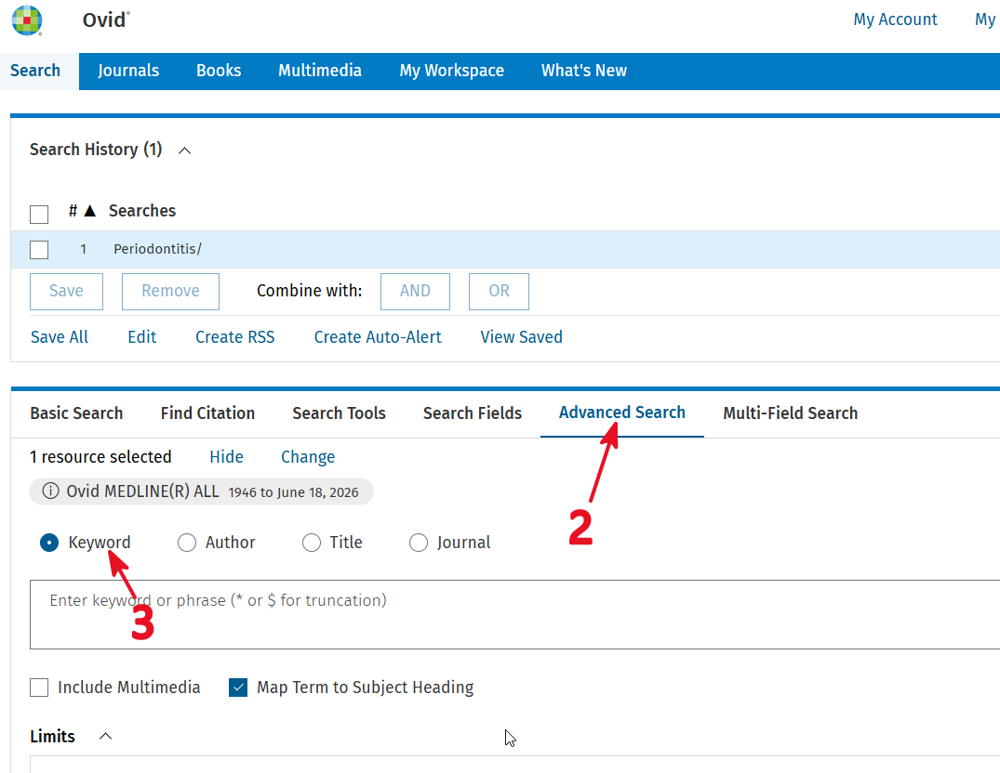
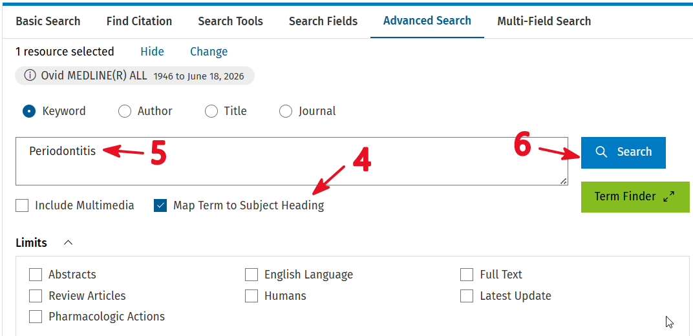
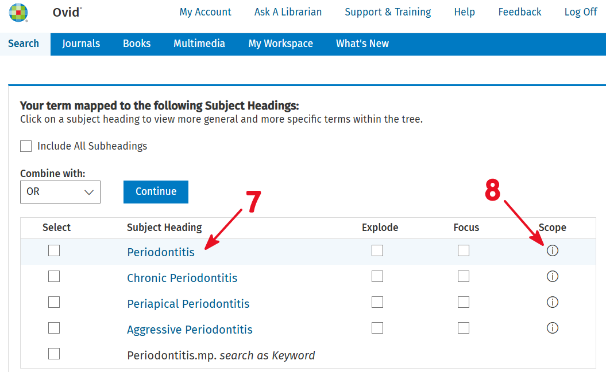
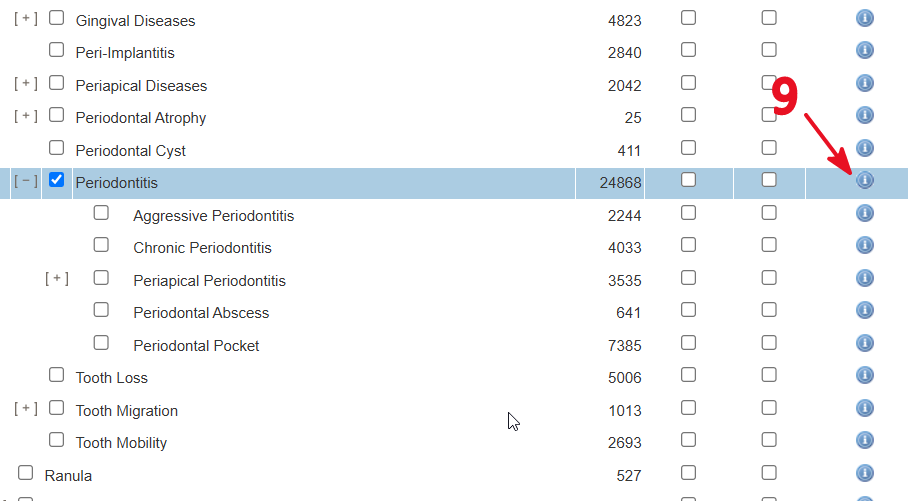
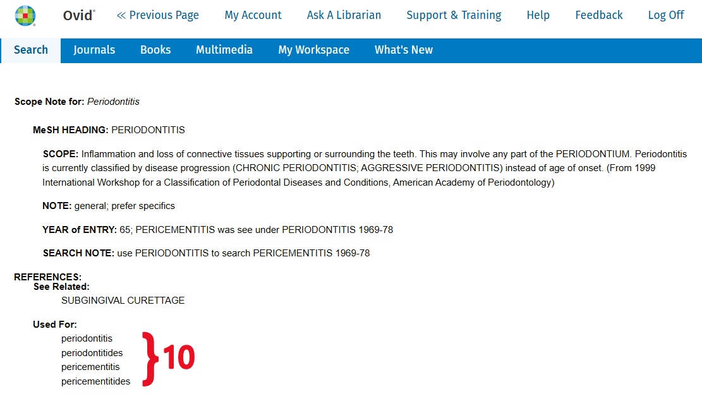

# Developing search term synonyms based on Ovid MeSH term Scope Note

## Introduction

When conducting a comprehensive search of medical literature, the use of Medical Subject Headings (MeSH) to retrieve articles tagged with relevant medical concepts is often recommended.

To improve search coverage, search statements can be further complemented by including synonyms associated with the MeSH terms. Below are the steps I have learned for extracting relevant synonyms via Ovid's MeSH term scope notes.

## Step: Identify synonyms

1. Head to Ovid Medline search engine (OvidSP).

1. Switch to `Advanced Search` tab.

1. Select `Keyword`.

    

1. Make sure `Map Term to Subject Heading` is checked.

1. Enter keyword, e.g. `Periodontitis`.

1. Click `Search`.

    

1. In the results of Subject Heading mapping (titled `Your term mapped to the following Subject Headings`), click on the Subject Heading to view the MeSH term using the Subject Heading tree view.

1. Alternatively, click the `i` icon (under the `Scope` column) to view the scope note.

    

1. In the Subject Heading tree view, scope note can be accessed by clicking the `i` icon (under the `Scope Note` column).

    

1. In the Scope Note page, extract the synonyms under `User For` heading: 

    

## Step: Comprehensive search

To perform a comprehensive search using Ovid Medline on periodontitis (for example): 

1. We use the MeSH term (i.e. `periodontitis/`).

    The trailing `/` signifies an exact subject heading search. It tells Ovid to look in the official subject heading field. It automatically includes any articles tagged with the narrower subject headings beneath it in the hierarchy.

1. We also combine the search with the following synonyms:

    ```
    pericementitides OR
    pericementitis OR
    periodontitides
    ```

    Which can be further simplified using the truncation syntax into:

    ```
    (pericementiti* OR periodontitide*).mp.
    ```

    `.mp.` stands for "multi purpose" for Ovid, by default it includes multiple field searches like title, abstract and keywords ([link](https://ospguides.ovid.com/OSPguides/medline.htm#mpalias)).

1. Combine all of the above using the `OR` operator:

    ```
    periodontitis/ OR
    (pericementiti* OR periodontitide*).mp.
    ```

## Credits

Credit goes to Dr. Ainol Haniza binti Kherul Anuwar, who originally taught me this method. She learned this technique during her tenure at the Malaysian Health Technology Assessment Section (MaHTAS), Ministry of Health Malaysia.

At the time of writing, Dr. Ainol is a senior lecturer in the Department of Community Oral Health & Clinical Prevention, Faculty of Dentistry, Universiti Malaya, Malaysia ([link to CV](https://umexpert.um.edu.my/ainolhaniza)).
